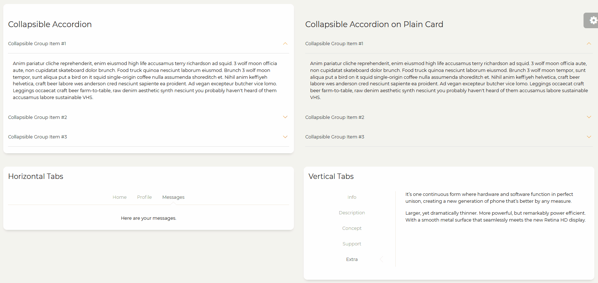
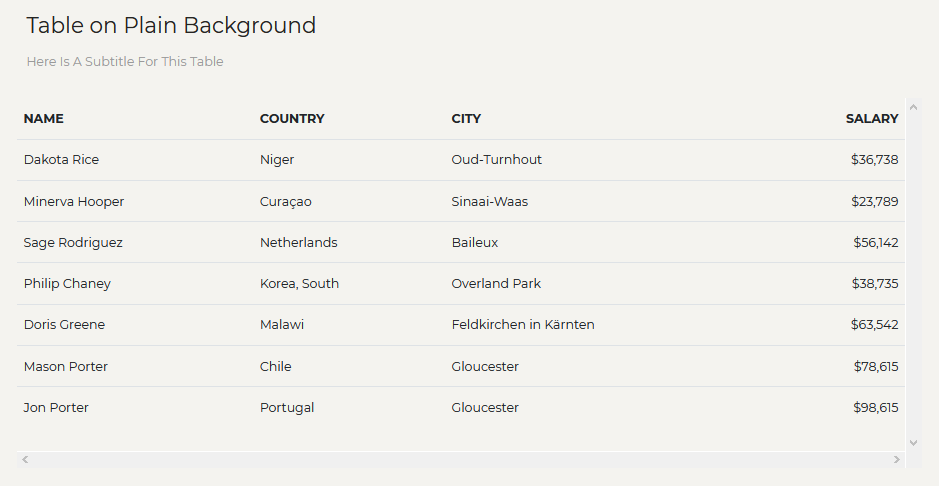

# TODO


## Components/Panel

([參考 Paper Dashboard](https://demos.creative-tim.com/paper-dashboard-2-pro/examples/components/panels.html))




## Interface/Modal

- 開啟一個 Modal ，在兩秒後關閉
  A message with auto close timer set to 2 seconds
- 開啟一個具有 input 的 Modal
  Modal window with input field


## Table




溶入背景的 Table

## Tabs


## Fade

```
import React, { useState } from 'react';
import { Button, Fade } from 'reactstrap';

const Example = (props) => {
    const [fadeIn, setFadeIn] = useState(true);

    const toggle = () => setFadeIn(!fadeIn);

    return (
        <div>
            <Button color="primary" onClick={toggle}>Toggle Fade</Button>
            <Fade in={fadeIn} tag="h5" className="mt-3">
                This content will fade in and out as the button is pressed
            </Fade>
        </div>
    );
}

export default Example;
```

## Layout

https://reactstrap.github.io/components/layout/

## Modals

https://reactstrap.github.io/components/modals/


